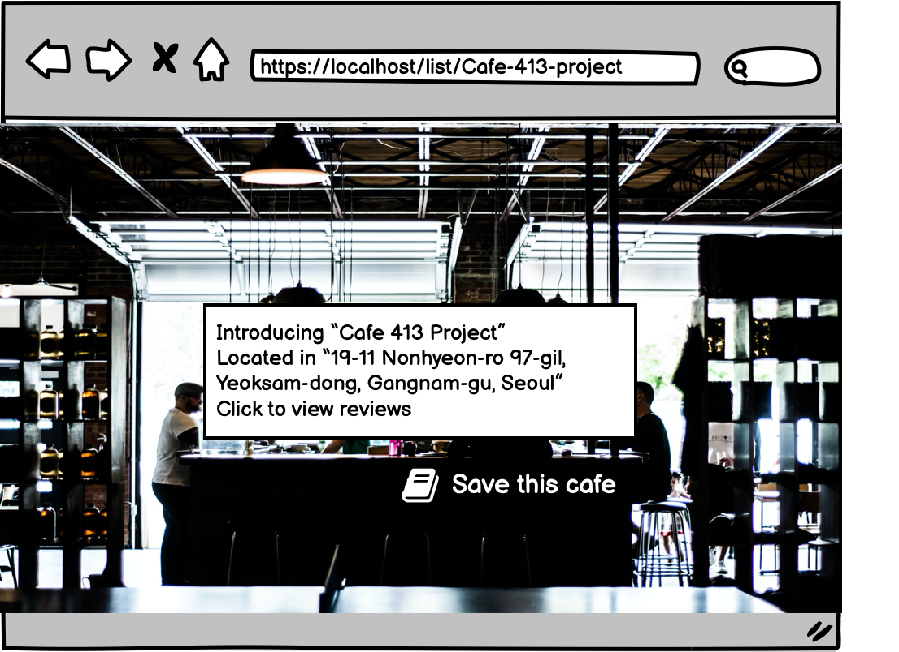

# Love You A Latte


<!-- if you used unit testing or functional testing, upload a screen shot or an animated gif of your tests running to the documentation folder of your project; link to it in your form submission
if you used grunt, gulp, or webpack … or some if you used a pre-processor like babel, sass, etc. … link to the relevant configuration file in your form submission
if you are using facebook login, and your application is in testing mode, add this user: Eef Aqua so that graders can test your application -->


## Overview

Espresso, americano, latte, mocha, macchiato. affocato! 

If you love drinking coffee, not only you might have tried reading best cafe reviews and might have wanted to save your favorite cafes. If you like to try out some new delicous cup of coffee in the hottest district of Seoul and even have a private cafe diary of your own, you could use this app. 

Love You A Latte is a web app that will allow users to view lists of cafes, register a cafe that is not on the site, store visited cafes with your own private coffee diary, and users can register and login. The cafe data are based on Gangam-Gu, Seocho-gu, Songpa-gu the trediest districts in Seoul, South Korea. 
Once they're logged in, they can view their saved cafes and view cafes all users have registered. For every cafe that have saved, they can add their private comments to the list.


## Data Model

The application will store Users, Cafes and MyCafes

* Cafes can have lists of users who saved the cafe. 
* Users can have lists of cafes added from cafes.
* Users can have lists of cafes with own ratings and comments added.


An Example CafeSchema:

```javascript
{
  cafename: "Cafe 413 Project",
  location: "19-11 Nonhyeon-ro 97-gil, Yeoksam-dong, Gangnam-gu, Seoul",
  reviewurl: "https://www.google.com/search?q=cafe+413+project&rlz=1C5CHFA_enKR912KR912&oq=cafe+413+project&aqs=chrome..69i57j46i175i199j69i57.3081j0j7&sourceid=chrome&ie=UTF-8#lrd=0x357ca3fc2962afef:0x53e1857cbb9aa5c9,1,,,",
  savedBy: //number of users that saved this cafe 
}
```


An Example UserSchema:

```javascript
{
  username: "CocoaMocha",
  email: "cocoa123@gmail.com",
  password: // a password hash,
  myCafe: // an array of references to List documents
}
```


An Example List of My List Schema:

```javascript
{
  username: "CocoaMocha", //from UserSchema 
  cafename: "Cafe 413 Project", //from CafeSchema
  location: "19-11 Nonhyeon-ro 97-gil, Yeoksam-dong, Gangnam-gu, Seoul", //from CafeSchema
  myRating: //number from 0-5 
  myComment: "Very nice brunch menus. Itimate atmosphere with nice plants. Worth revisiting" 
}
```

## [Link to Commented Second Draft Schema](src/db.js) 


## Wireframes


/list/create - Home page


/list - page for showing all cafes registered by all users


/list/slug - page for showing specific cafe



/list/add - page for adding cafes


/:username - page that allows user to save cafe


/:username/cafenmae - page that allows user to rate and comment on cafe


## Site map


## User Stories or Use Cases

1. as non-registered user, I can register a new account 
2. as non-registered user, I can review cafe lists.
3. as non-registered user, I cannot add new cafe to cafe lists.
4. as non-registered user, I cannot save cafes. 
5. as a user, I can log in to the site
6. as a user, I can add new cafe to cafe lists.
7. as a user, I can view all cafes that I have saved or added.
8. as a user, I can add comments and ratings to cafe I have saved.
9. as a user, I can delete comments and ratings. 

## Research Topics

* (3 points) Unit testing with JavaScript
    - Mocha, Jest, Jasmine, ChaiJS
* (3 points) Configuration management  - nconf
* (2 points )Use a CSS framework throughout your site, use a reasonable of customization of the framework 
    * I am going to learn bootstrap and make use of bootstrap in some amount. 

8 points total out of 8 required points. (If I have more time, I may try to make use of map API for location...)


## [Main Project File](src/app.js) 

```
├── README.md
├── package.json
├── package-lock.json
├── documentation
├── app.js
├── auth.js
├── db.js
├── public
├   ├── css
├   └── img 
├── views
    ├── login.hbs
    ├── register.hbs
    ├── list.hbs
    ├── list-detail.hbs
    ├── list-add.hbs
    ├── mylist.hbs
    ├── mylist-detail.hbs
    ...


```

## Annotations / References Used


1. [nconf docs](https://www.npmjs.com/package/nconf)
2. [tutorial on bootstrap](https://www.youtube.com/watch?v=c9B4TPnak1A) 
3. [jest docs](https://jestjs.io/)
4. [jasmine docs](https://jasmine.github.io/pages/docs_home.html)
5. [chai docs](https://www.chaijs.com/)
6. [mocha docs](https://mochajs.org/)

I will add more good resources as I research throughout the project. 